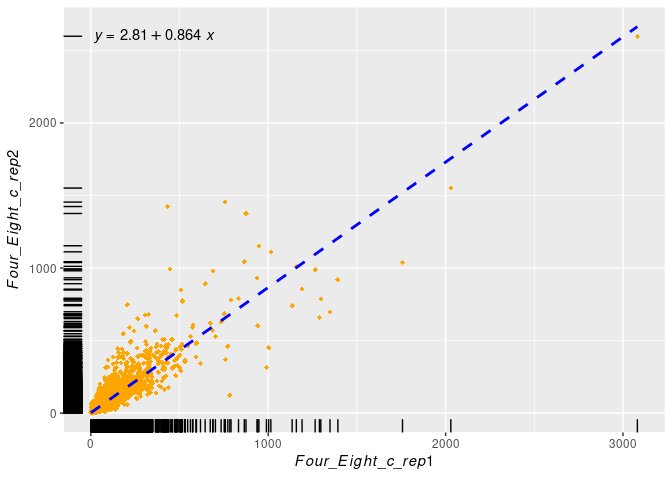

Homework
================
Sobhan Bahrami
5/3/2022

## R Markdown

This is an R Markdown document. Markdown is a simple formatting syntax
for authoring HTML, PDF, and MS Word documents. For more details on
using R Markdown see <http://rmarkdown.rstudio.com>.

When you click the **Knit** button a document will be generated that
includes both content as well as the output of any embedded R code
chunks within the document. You can embed an R code chunk like this:

``` r
read_counts <- read_csv("/home/sobhan/Desktop/Bowtie_aligned_>=1_time_normalized_by_read_counts.csv")
```

    ## Rows: 15544 Columns: 6

    ## ── Column specification ────────────────────────────────────────────────────────
    ## Delimiter: ","
    ## chr (2): Gene, Length
    ## dbl (4): Two_Four_c_rep1, Two_Four_c_rep2, Four_Eight_c_rep1, Four_Eight_c_rep2

    ## 
    ## ℹ Use `spec()` to retrieve the full column specification for this data.
    ## ℹ Specify the column types or set `show_col_types = FALSE` to quiet this message.

``` r
print(read_counts)
```

    ## # A tibble: 15,544 × 6
    ##    Gene   Length Two_Four_c_rep1 Two_Four_c_rep2 Four_Eight_c_rep1
    ##    <chr>  <chr>            <dbl>           <dbl>             <dbl>
    ##  1 g00001 L               0                  0                 0  
    ##  2 g00002 L               0                  0                 0  
    ##  3 g00003 L               0                  0                 0  
    ##  4 g00004 S               0.0676             0                 0  
    ##  5 g00005 L               0                  0                 0  
    ##  6 g00006 S               0                  0                 0  
    ##  7 g00007 L               0                  0                 0  
    ##  8 g00008 L              59.5               31.8              44.6
    ##  9 g00009 S              95.6               39.3              78.4
    ## 10 g00010 S             137.                59.6             122. 
    ## # … with 15,534 more rows, and 1 more variable: Four_Eight_c_rep2 <dbl>

``` r
Average<-c(Two_Four_c_rep1=mean(read_counts$Two_Four_c_rep1),Two_Four_c_rep2=mean(read_counts$Two_Four_c_rep2),Four_Eight_c_rep1=mean(read_counts$Four_Eight_c_rep1),Four_Eight_c_rep2=mean(read_counts$Four_Eight_c_rep2))
Average
```

    ##   Two_Four_c_rep1   Two_Four_c_rep2 Four_Eight_c_rep1 Four_Eight_c_rep2 
    ##          31.64043          22.64134          32.68344          26.66441

``` r
read_counts_summ <- read_counts %>%
  group_by(Length) %>%
  summarise(mean.Two_Four_c_rep1 = mean(Two_Four_c_rep1, na.rm = TRUE),
            mean.Two_Four_c_rep2 = mean(Two_Four_c_rep2, na.rm = TRUE),
            mean.Four_Eight_c_rep1 = mean(Four_Eight_c_rep1, na.rm = TRUE),
            mean.Four_Eight_c_rep2 = mean(Four_Eight_c_rep2, na.rm = TRUE))
read_counts_summ 
```

    ## # A tibble: 2 × 5
    ##   Length mean.Two_Four_c_rep1 mean.Two_Four_c… mean.Four_Eight… mean.Four_Eight…
    ##   <chr>                 <dbl>            <dbl>            <dbl>            <dbl>
    ## 1 L                      33.2             26.1             35.0             33.0
    ## 2 S                      29.6             18.1             29.6             18.2

``` r
read_counts_norm <- read_counts %>%
  group_by(Length) %>%
  mutate(norm.Two_Four_c_rep1 = Two_Four_c_rep1 * (1000000/sum(Two_Four_c_rep1, na.rm = TRUE)),
         norm.Two_Four_c_rep2 = Two_Four_c_rep2 * (1000000/sum(Two_Four_c_rep2, na.rm = TRUE)),
         norm.Four_Eight_c_rep1 = Four_Eight_c_rep1 * (1000000/sum(Four_Eight_c_rep1, na.rm = TRUE)),
         norm.Four_Eight_c_rep2 = Four_Eight_c_rep2 * (1000000/sum(Four_Eight_c_rep2, na.rm = TRUE)))
glimpse(read_counts_norm)
```

    ## Rows: 15,544
    ## Columns: 10
    ## Groups: Length [2]
    ## $ Gene                   <chr> "g00001", "g00002", "g00003", "g00004", "g00005…
    ## $ Length                 <chr> "L", "L", "L", "S", "L", "S", "L", "L", "S", "S…
    ## $ Two_Four_c_rep1        <dbl> 0.00000000, 0.00000000, 0.00000000, 0.06758527,…
    ## $ Two_Four_c_rep2        <dbl> 0.0000000, 0.0000000, 0.0000000, 0.0000000, 0.0…
    ## $ Four_Eight_c_rep1      <dbl> 0.0000000, 0.0000000, 0.0000000, 0.0000000, 0.0…
    ## $ Four_Eight_c_rep2      <dbl> 0.0000000, 0.0000000, 0.0000000, 0.0000000, 0.0…
    ## $ norm.Two_Four_c_rep1   <dbl> 0.0000000, 0.0000000, 0.0000000, 0.3404518, 0.0…
    ## $ norm.Two_Four_c_rep2   <dbl> 0.000000, 0.000000, 0.000000, 0.000000, 0.00000…
    ## $ norm.Four_Eight_c_rep1 <dbl> 0.0000000, 0.0000000, 0.0000000, 0.0000000, 0.0…
    ## $ norm.Four_Eight_c_rep2 <dbl> 0.000000, 0.000000, 0.000000, 0.000000, 0.00000…

``` r
read_counts_norm
```

    ## # A tibble: 15,544 × 10
    ## # Groups:   Length [2]
    ##    Gene   Length Two_Four_c_rep1 Two_Four_c_rep2 Four_Eight_c_rep1
    ##    <chr>  <chr>            <dbl>           <dbl>             <dbl>
    ##  1 g00001 L               0                  0                 0  
    ##  2 g00002 L               0                  0                 0  
    ##  3 g00003 L               0                  0                 0  
    ##  4 g00004 S               0.0676             0                 0  
    ##  5 g00005 L               0                  0                 0  
    ##  6 g00006 S               0                  0                 0  
    ##  7 g00007 L               0                  0                 0  
    ##  8 g00008 L              59.5               31.8              44.6
    ##  9 g00009 S              95.6               39.3              78.4
    ## 10 g00010 S             137.                59.6             122. 
    ## # … with 15,534 more rows, and 5 more variables: Four_Eight_c_rep2 <dbl>,
    ## #   norm.Two_Four_c_rep1 <dbl>, norm.Two_Four_c_rep2 <dbl>,
    ## #   norm.Four_Eight_c_rep1 <dbl>, norm.Four_Eight_c_rep2 <dbl>

``` r
nested_df <- read_counts_norm %>%
  group_by(Length) %>%
  nest()
#nested_df$data[[1]]
glimpse(nested_df$data[[1]])
```

    ## Rows: 8,843
    ## Columns: 9
    ## $ Gene                   <chr> "g00001", "g00002", "g00003", "g00005", "g00007…
    ## $ Two_Four_c_rep1        <dbl> 0.00000000, 0.00000000, 0.00000000, 0.00000000,…
    ## $ Two_Four_c_rep2        <dbl> 0.000000, 0.000000, 0.000000, 0.000000, 0.00000…
    ## $ Four_Eight_c_rep1      <dbl> 0.0000000, 0.0000000, 0.0000000, 0.0000000, 0.0…
    ## $ Four_Eight_c_rep2      <dbl> 0.0000000, 0.0000000, 0.0000000, 0.0000000, 0.0…
    ## $ norm.Two_Four_c_rep1   <dbl> 0.0000000, 0.0000000, 0.0000000, 0.0000000, 0.0…
    ## $ norm.Two_Four_c_rep2   <dbl> 0.00000, 0.00000, 0.00000, 0.00000, 0.00000, 13…
    ## $ norm.Four_Eight_c_rep1 <dbl> 0.0000000, 0.0000000, 0.0000000, 0.0000000, 0.0…
    ## $ norm.Four_Eight_c_rep2 <dbl> 0.000000, 0.000000, 0.000000, 0.000000, 0.00000…

## Including Plots

You can also embed plots, for example:

    ## `geom_smooth()` using formula 'y ~ x'

<!-- -->

    ## `geom_smooth()` using formula 'y ~ x'

<!-- -->

Note that the `echo = FALSE` parameter was added to the code chunk to
prevent printing of the R code that generated the plot.
